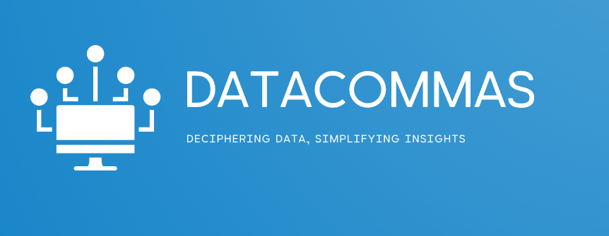

# Pulsar 

# Decommas: Deciphering Data, Simplifying Insights

## Informations

NodeJS need at least 18.3

## Overview:

Pulsar  is a transformative web application with a mission to decode complex blockchain data, providing users with comprehensive insights and simplified visualizations. Our platform offers two central features.

## Wallet Visualization:

### Erc20, NFT, and Transactions:
Pulsar  offers a holistic view of your blockchain wallet, encompassing ERC20 tokens, NFTs, and transaction histories.
### User-Centric:
We prioritize user-friendliness, ensuring individuals of all backgrounds can easily access and comprehend their wallet data.

## Blockchain Data for Informed Decision-Making:

### Empowering Insights:
Pulsar  equips users with data-driven insights, aiding them in making informed decisions within the blockchain space.

### High-Volume Analytics:
Our platform can efficiently handle large datasets, making it a valuable tool for users with significant blockchain activities.

## Development and Deployment:

### Innovation:
Pulsar  is dedicated to providing a unique and innovative user experience, setting new standards in blockchain data visualization.
### Technical Excellence:
Our project boasts a robust technical implementation, ensuring a seamless and reliable user experience.
### Secure Deployment:
The web app is securely deployed with an SSL certificate to safeguard users' data.
### Open Source:
The mobile app project is open-sourced, promoting transparency and collaboration within the developer community.

## Future Prospects:

Pulsar  is poised for future growth and development. We are actively exploring opportunities for integration with Optimism and OP-stack chains (Base, opBNB), expanding our capabilities and enhancing the user experience.

## Conclusion:

Pulsar  is not just a blockchain data tool; it's a catalyst for change in how users interact with blockchain technology. We simplify complex data, offering users clear and comprehensive insights into their blockchain activities. Join us on this exciting journey as we explore DeCommas' "Mission Control" API and redefine the way data is deciphered and insights are simplified for users worldwide.